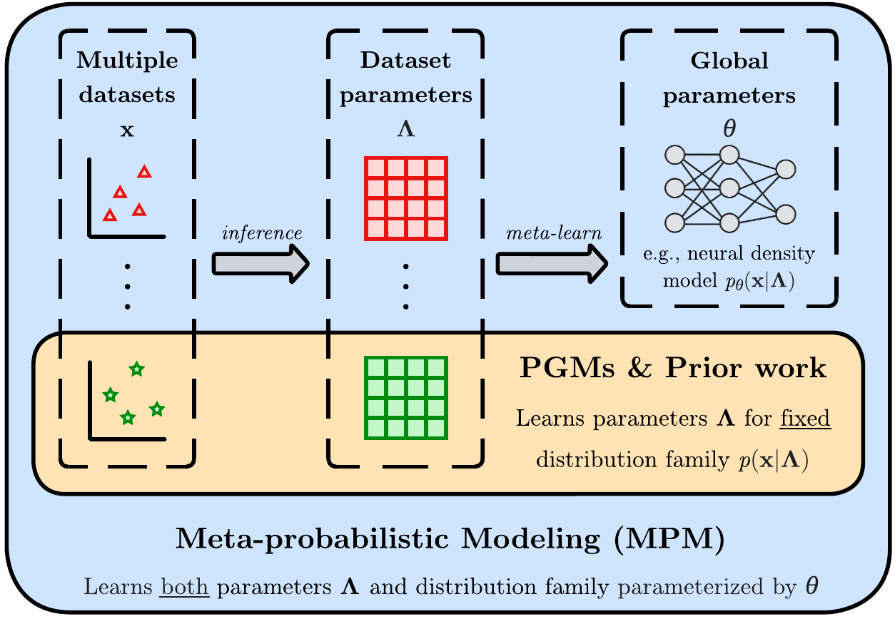
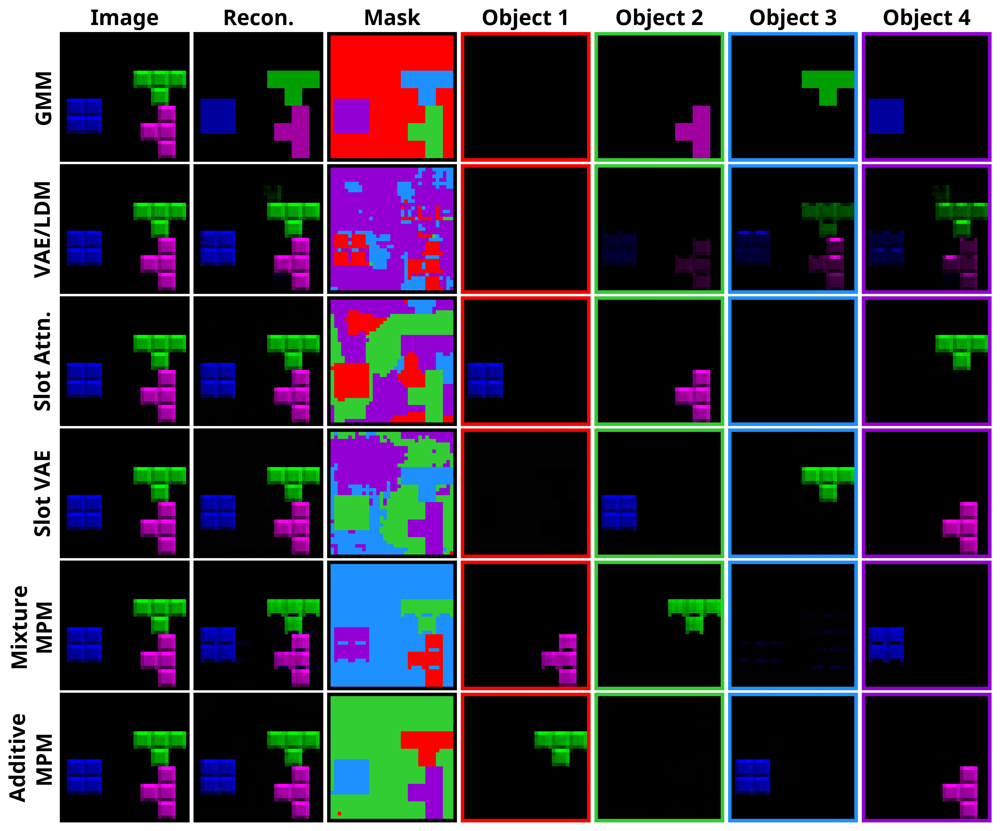

# Meta-probabilistic Modeling

This repository contains the official implementation of **[Meta-probabilistic Modeling](URL)** [1].

## Introduction

**Meta-probabilistic Modeling (MPM)** is a probabilistic modeling approach that learns the *family of generative model distributions* using multiple related datasets.

<p align="center">
  
</p>

We also develop a tractable learning and inference procedure with connections to **Slot Attention** [2].

<p align="center">
    
</p>

## Repository Structure

```text
object_centric_learning/        # Object-centric learning experiments
├── analysis/                   # Evaluation and visualization
├── mpm/                        # Meta-probabilistic models
└── diffusion/                  # VAE/diffusion baselines

sequential_text_modeling/       # Topic modeling experiments
├── analysis/                   # Evaluation and visualization
├── mpm/                        # Meta-probabilistic models
└── lda/                        # LDA baseline
```

## Getting Started

### Prerequisites

Clone the repo, create a virtual environment with Python version 3.10

```
conda create -n mpm python=3.10
```
Then, install the `requirements.txt` file
```
pip install -r requirements.txt
```

### Data

For the object-centric learning experiments, we use the **[Tetrominoes dataset](https://github.com/google-deepmind/multi_object_datasets)** from the multi-object datasets collection introduced by DeepMind.

For the sequential text modeling experiments, we use a subset of the **[Associated Press (AP) News corpus](https://github.com/blei-lab/lda-c)** commonly used in topic modeling benchmarks.

### Baselines

In addition to classical baselines (e.g. GMM and LDA), we compare against several modern neural architectures based on Slot Attention for the object-centric learning experiments, and Neural Topic Models for the sequential text experiments. The implementations for these baselines were taken directly from the corresponding GitHub repositories listed below.

**Object-Centric Learning**

- [Slot Attention](https://github.com/evelinehong/slot-attention-pytorch)
- [Slot VAE](https://github.com/YWangatTUD/Slot-VAE)

**Topic Modeling**

- [Neural Document Models](https://github.com/YongfeiYan/Neural-Document-Modeling)
- [WeTe](https://github.com/wds2014/WeTe)
- [FASTopic](https://github.com/bobxwu/FASTopic)

### Running Experiments

To run the experiments, navigate to the appropriate experiment directory and execute:
```
python train_eval.py --config=config.yaml --beta=[beta value] --seed=[random seed]
```
Hyperparameters can be modified in the corresponding `config.yaml` file.

To run the LDA baseline, navigate to `sequential-text-modeling/lda` and run the `lda.ipynb` notebook.

### Evaluations

To evaluate the models, navigate to the appropriate `analysis` directory and run the provided notebooks. Note that `object-centric-learning/analysis/viz.ipynb` and `sequential-text-modeling/analysis/coherence.ipynb` assume that the baseline results have already been generated.

## References

[1] Kevin Zhang, Yixin Wang. *Meta-probabilistic Modeling*. AISTATS, 2026.

[2] Francesco Locatello, Dirk Weissenborn, Thomas Unterthiner, Aravindh Mahendran, Georg Heigold, Jakob Uszkoreit, Alexey Dosovitskiy, and Thomas Kipf. *Object-centric learning with slot attention*. NeurIPS, 2020.

## Citation

If you find this work useful, please cite:

```bibtex
@inproceedings{zhang2026mpm,
  title     = {Meta-probabilistic Modeling},
  author    = {Zhang, Kevin and Wang, Yixin},
  booktitle = {Proceedings of the International Conference on Artificial Intelligence and Statistics (AISTATS)},
  year      = {2026}
}
```